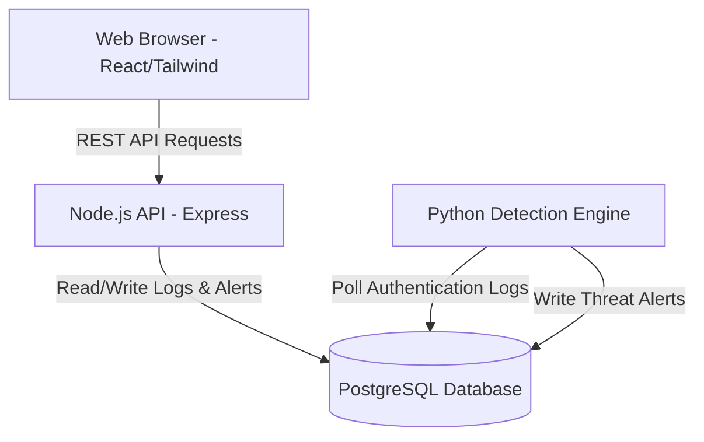

# Mini-SIEM — Security Information and Event Management

A lightweight SIEM (Security Information and Event Management) platform built with a Node.js/Express backend and a modern React frontend. This project demonstrates core security engineering concepts: API rate limiting, brute force detection, role-based access control, real-time security alerting, alert triage workflows, and dynamic dashboard analytics.

---

## Repository Structure

```text
mini-siem/
├── backend/           # Node.js & Express API — security engine, alerting, RBAC
├── frontend/          # React & Vite SPA — dashboard, logs explorer, alert management
└── security_python/   # Python Engine — PostgreSQL integration, brute force detection
```

---

## Features

### Comprehensive Security Capabilities
- **API Rate Limiting:** Tiered limiters using `express-rate-limit` for global endpoints, logins, and alerts.
- **Brute Force Defense:** Two-layer protection on authentication endpoints with automatic account lockouts and IP banning.
- **Role-Based Access Control (RBAC):** `user`, `operator`, and `admin` roles with progressive access levels enforced on every route.
- **Authentication & Authorization:** Secure JWT-based authentication with encrypted password storage.
- **Risk Scoring & Threat Levels:** Computed risk scores per IP based on behavioral history (`LOW` → `CRITICAL`).

### Automated Detection & Alerting
- **Alert Engine (Node.js):** Auto-generated alerts for brute force, rate limit violations, unauthorized access, invalid tokens, and role escalation attempts.
- **Polling Detection Engine (Python):** Background worker that analyzes authentication logs to dynamically detect sustained attacks and generates persistent alerts.
- **Automated Triage:** Built-in severity calculation and automated database persistence for high-priority threats.

### Operations Dashboard (Frontend)
- **Real-Time Analytics:** Live dashboard with metrics for total events, login success rate, active brute force threats, and unacknowledged alerts.
- **Risk Visualization:** Dynamic bar charts using Recharts to visualize high-risk entities and recent alerts timeline panel.
- **Logs Explorer:** Searchable, filterable, and paginated view of all system security events.
- **Alert Management System:** 
  - Live statistics for Total, Unacknowledged, Last-24h, and per-severity alerts.
  - One-click and bulk acknowledge capabilities.
  - Create manual alerts, permanently delete alerts (admin only).
- **Premium Aesthetics:** Modern dark-mode UI built with Tailwind CSS v4, featuring glassmorphism and responsive design.
- **Toast Notifications:** Real-time feedback for every action.

---

## System Architecture

The Mini-SIEM platform employs a modern microservices-oriented architecture fully containerized with Docker:



- **Frontend (React + Vite + Tailwind CSS v4):** Serves the interactive user interface.
- **Backend API (Node.js + Express):** Handles routing, JWT authentication, RBAC, rate limiting, and directly interacts with the database for CRUD operations.
- **Database (PostgreSQL):** Central repository for users, security logs, alerts, and system state.
- **Detection Engine (Python):** Background worker that continuously polls the database for suspicious activities and generates high-severity alerts.

---

## Threat Model

Mini-SIEM is designed to detect and mitigate several common security threats:

1. **Brute Force Attacks:** 
   - *Threat:* Attackers attempting to guess user credentials through repeated login attempts.
   - *Mitigation:* The Python Detection Engine monitors failed login attempts and flags IP addresses exceeding thresholds. The Node.js backend automatically locks accounts and rate-limits offending IPs.

2. **Denial of Service (DoS) via API Abuse:**
   - *Threat:* Malicious actors overwhelming the server with excessive API requests.
   - *Mitigation:* Tiered rate-limiting implemented via `express-rate-limit` on global, login, and alert endpoints.

3. **Privilege Escalation:**
   - *Threat:* Standard users attempting to access administrative or operator-level functions.
   - *Mitigation:* Strict Role-Based Access Control (RBAC) enforced on every backend route, validating JWT claims.

4. **Unauthorized Access & Token Theft:**
   - *Threat:* Accessing protected resources without valid credentials.
   - *Mitigation:* JWT-based authentication with expiration, requiring valid headers for all protected API calls. Invalid token attempts trigger security alerts.

---

## Deployment & Getting Started

Mini-SIEM is fully containerized using Docker, allowing for a seamless deployment process.

### Prerequisites
- [Docker](https://docs.docker.com/get-docker/) and [Docker Compose](https://docs.docker.com/compose/install/) installed on your host machine.

### Production Deployment (Recommended)

The entire application stack (Frontend, Backend, Database, Python Engine) can be launched with a single command.

1. **Clone the repository:**
   ```bash
   git clone https://github.com/your-username/mini-siem.git
   cd mini-siem
   ```

2. **Run with Docker Compose:**
   ```bash
   docker-compose up -d --build
   ```

3. **Access the Application:**
   - **Frontend UI:** `http://localhost:5173`
   - **Backend API:** `http://localhost:5000`

### Local Development Setup

If you prefer to run the services locally for development:

1. **Start the Database:**
   ```bash
   docker-compose up -d db
   ```

2. **Start the Backend Server:**
   ```bash
   cd backend
   npm install
   npm run dev
   ```
   *(Ensure a `.env` file exists with `PORT=5000` and `JWT_SECRET=your-secret-key`)*

3. **Start the Python Detection Engine:**
   ```bash
   cd security_python
   pip install -r requirements.txt
   python detector.py
   ```

4. **Start the Frontend:**
   ```bash
   cd frontend
   npm install
   npm run dev
   ```

### Default Credentials
On the login screen, you can use the **"Login as Demo Admin"** button, or manually enter the seeded credentials:
- **Email:** `admin@siem.local`
- **Password:** `Admin@1234`

---

## API Reference

### Dashboard
| Method | Endpoint | Description |
|--------|----------|-------------|
| `GET` | `/api/dashboard/summary` | Full overview of events, alerts, and brute-force metrics |
| `GET` | `/api/security/risk-scores` | Dynamically computed IP risk scores |
| `GET` | `/api/security/logs` | Filterable, paginated audit log |

### Alert Management
| Method | Endpoint | Description |
|--------|----------|-------------|
| `GET` | `/api/alerts` | List alerts (filterable by `severity`, `type`, `acknowledged`) |
| `GET` | `/api/alerts/stats` | Counts by severity, type, and 24h window |
| `GET` | `/api/alerts/types` | Enumeration of all valid alert types |
| `GET` | `/api/alerts/:id` | Single alert by ID |
| `POST` | `/api/alerts` | Create a manual alert |
| `PATCH` | `/api/alerts/:id/acknowledge` | Acknowledge a single alert |
| `PATCH` | `/api/alerts/acknowledge-all` | Bulk-acknowledge with optional severity/type filter |
| `DELETE` | `/api/alerts/:id` | Delete an alert (admin only) |

### Auth
| Method | Endpoint | Description |
|--------|----------|-------------|
| `POST` | `/api/auth/register` | Register a new user |
| `POST` | `/api/auth/login` | Login and receive a JWT |

---

## Tech Stack

| Layer | Technology |
|-------|-----------|
| Backend | Node.js, Express 5, express-rate-limit, jsonwebtoken, bcrypt |
| Detection Engine | Python, psycopg2 |
| Frontend | React 19, Vite, React Router v7, Recharts, Lucide React, Tailwind CSS v4 |
| Database | PostgreSQL 15 (Docker) |
| Styling | Tailwind CSS v4, minimal dark theme, glassmorphism |

---

_Developed by Philip Magar_
